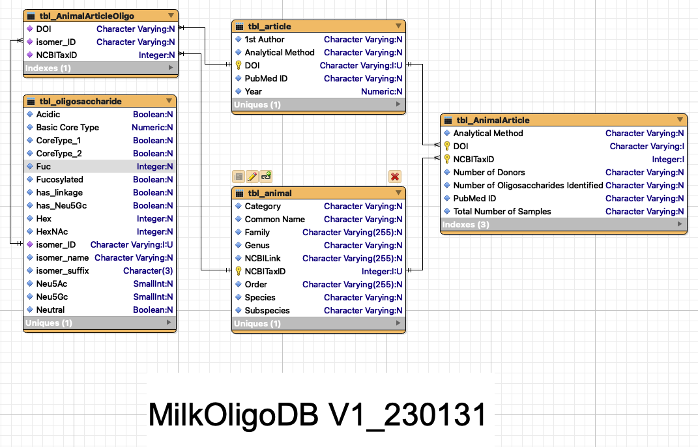

# -MilkOligoDB-
A database of oligosaccharides found in mammalian milks.
This database is a collaboration between the *Barile Lab at UC Davis and IC-FOODS, the International Center for Food Ontology Operability Data and Semantics, and the Lemay Lab at the USDA Western Human Nutrition Research Center*.

The database is designed has been designed as a normalized relational database whose schema can be visulaized at the bottom of this document. Scripts for creating the tables in an open source PostGreSQL relational database management system, as well as some foundational views (queries) are available in the scripts folder. Data for instantiating these tables can be found in the *data for ingest* folder.
For users who want to quickly upload data into spreadsheet software, or otherwise convert it to another format, they can download MilkOligoDB.csv which contains all data in a single file.

